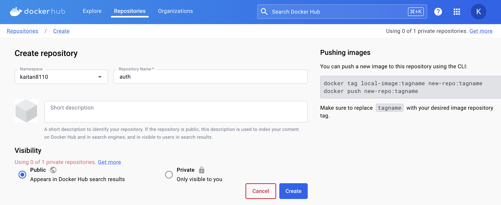
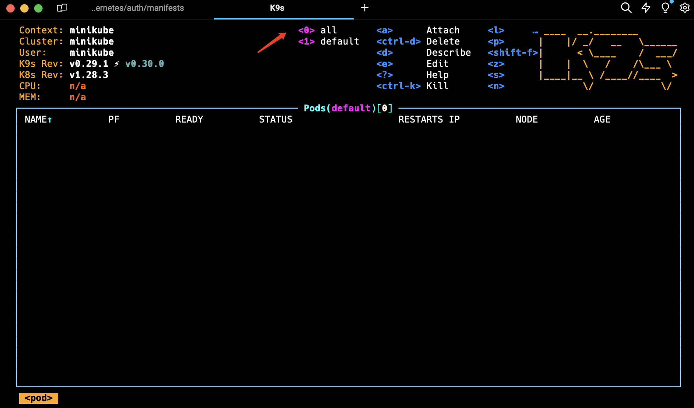

### Auth Service

Create a directory for auth and cd into it.  
```
mkdir auth
cd auth
```

Create a virtual env within auth. 
```
python3 -m venv venv
```

Activate virtual env. 
```
source ./venv/bin/activate
```

All of the codes for this service will be created in server.py. Create server.py. 
```
vim server.py
```

Write the following lines of code in server.py. 
```
import jwt, datetime, os
from flask import Flask, request
from flask_mysqldb import MySQL
```

Install the above needed packages in current virtual env. 
```
pip install pyjwt flask flask_mysqldb 
```

Add the following lines of code in server.py. 
```
import jwt, datetime, os
from flask import Flask, request
from flask_mysqldb import MySQL

server = Flask(__name__)
# So that our application can connect to our MySQL datebase. And able to query the database. 
mysql = MySQL(server)

# Configuration for our server, or for our application
# Variables that we used to connect to our mysql database
server.config["MYSQL_HOST"] = os.environ.get("MYSQL_HOST")
server.config["MYSQL_USER"] = os.environ.get("MYSQL_USER")
server.config["MYSQL_PASSWORD"] = os.environ.get("MYSQL_PASSWORD")
server.config["MYSQL_DB"] = os.environ.get("MYSQL_DB")
server.config["MYSQL_PORT"] = int(os.environ.get("MYSQL_PORT"))

@server.route("/login", methods=["POST"])
def login():
	auth = request.authorization
	if not auth:
		return "missing credentials", 401

	# check db for username and password
```
Save and exit vim. 


Next, create a user for our auth service, and give that user a username and password. Then create a MySQL database `auth`. It will be the database of our auth service. Grant the user the privileges to the database, and create a table within that database, named `user`.  The user table is going to be what we use to store users that we want to give access to our api.  

Create a file named `init.sql`.

```
vim init.sql
```

Add below content to `init.sql`. 
```
CREATE USER 'auth_user'@'localhost' IDENTIFIED BY 'ComplexPassword123!';

CREATE DATABASE auth; 

GRANT ALL PRIVILEGES ON auth.* TO 'auth_user'@'localhost';

USE auth;

CREATE TABLE user (
	id INT NOT NULL AUTO_INCREMENT PRIMARY KEY,
	email VARCHAR(255) NOT NULL UNIQUE,
	password VARCHAR(255) NOT NULL
);

# You may use your own email and password below.
INSERT INTO user (email, password) VALUES ('kaitan8110@gmail.com', 'Admin123');
```
Save and exit vim. 

Go into our database. 
```
mysql -uroot
```

Show databases. 
```
show databases; 
```
You can see that we don't have the `auth` database yet. 

We can exit MySQL first. 
```
exit
```

Run the `init.sql` within MySQL. 
```
mysql -uroot < init.sql
```

You may run the below command to check that *auth* database and *user* table have been created. 
```
mysql -uroot
show databases;
use auth;
show tables;
describe user;
select * from user;
```

Continue writing code for `server.py`. 

```
import jwt, datetime, os
from flask import Flask, request
from flask_mysqldb import MySQL

server = Flask(__name__)
# So that our application can connect to our MySQL datebase. And able to query the database. 
mysql = MySQL(server)

# Configuration for our server, or for our application
# Variables that we used to connect to our mysql database
server.config["MYSQL_HOST"] = os.environ.get("MYSQL_HOST")
server.config["MYSQL_USER"] = os.environ.get("MYSQL_USER")
server.config["MYSQL_PASSWORD"] = os.environ.get("MYSQL_PASSWORD")
server.config["MYSQL_DB"] = os.environ.get("MYSQL_DB")
server.config["MYSQL_PORT"] = int(os.environ.get("MYSQL_PORT"))

@server.route("/login", methods=["POST"])
def login():
	auth = request.authorization
	if not auth:
		return "missing credentials", 401

	# check db for username and password
	cur = mysql.connection.cursor()
	res = cur.execute(
		"SELECT email, password FROM user WHERE email=%s", (auth.username,)
	)

	if res > 0:
		user_row = cur.fetchone()
		email = user_row[0]
		password = user_row[1]

		if auth.username != email or auth.password != password:
			return "invalid credentials", 401
		else:
			return createJWT(auth.username, os.environ.get("JWT_SECRET"), True)
	else:
		return "invalid credentials", 401
```

Next we will create the `createJWT` function. Add the below code to `server.py`. 
```
def createJWT(username, secret, authz):
	return jwt.encode(
		{
			"username": username, 
			"exp": datetime.datetime.now(tz=datetime.timezone.utc) + datetime.timedelta(days=1),
			"iat": datetime.datetime.utcnow(),
			"admin": authz,
		},
		secret,
		algorithm="HS256",
	)
```

Add below code to `server.py` as well. 
```
if __name__ == "__main__":
	# To allow our application to listen to any ip address on our host. 
	# This tells your operating system to listen on all public IPs. 
	server.run(host="0.0.0.0", port=5000)
```

Next, we will actually want to create another route to validate JWT. And this route is going to be used by our api gateway to validate JWT sent within request from the client to both upload videos and download MP3 version of those videos. 

Add below lines to `server.py`.
```
@server.route("/validate", method=["POST"])
def validate():
	encoded_jwt = request.headers["Authorization"]

	if not encoded_jwt:
		return "missing credentials", 401
	
	encoded_jwt = encoded_jwt.split(" ")[1]

	try:
		decoded = jwt.decode(
			encoded_jwt,
			os.environ.get("JWT_SECRET"),
			algorithm=["HS256"]
		)
	except:
		return "not authorized", 403
	
	return decoded, 200
```

Next, we are going to write all the infrastructure code for the deployment. We are basically going to deploy all of our services within a kubernetes cluster. We need to create docker images that we need to push to a repository, and our kubernetes configuration is going to pull it from the repository, and create our deployments within our cluster. 

Let's create our `requirements.txt` first. 
```
pip3 freeze > requirements.txt
```

We will start by creating a docker file. 
```
vim Dockerfile
```

Fill in the below lines. 
```
FROM python:3.10-slim-bullseye

RUN apt-get update \
    && apt-get install -y --no-install-recommends --no-install-suggests \
    build-essential default-libmysqlclient-dev \
    && pip install --no-cache-dir --upgrade pip

WORKDIR /app
COPY ./requirements.txt /app
RUN pip install --no-cache-dir --requirement /app/requirements.txt
COPY . /app

EXPOSE 5000

CMD ["python3", "server.py"]
```
Save and exit vim. 

Build the above docker file. 
```
docker build .
```

Next, login to docker hub and create an `auth` repository. For *Repository Name*, key in *auth*. Then click on **create**. 


Next we want to tag the image we just built. 
```
docker tag <copy-and-paste-the-sha256-here-after-you-built-the-image> <your-docker-username>/auth:latest
```

You can also run the below command to see your latest tagged image. 
```
docker image ls
```


Next, we can push it to our repository. 
```
docker push <your-docker-username>/auth:latest
```

Once that is finished, you can go to your **auth** repository and refresh the page. You should see your image tag here. That means we successfully push this image to our repository. 


Next, make a directory named `manifests`. This directory is going to contain all of the `auth` service's kubernetes configuration. 
```
mkdir manifests
```

Change directory to manifests. 
```
cd manifests
```

Create an `auth-deploy.yaml` file with the below content.
```
apiVersion: apps/v1
kind: Deployment
metadata:
  name: auth
  labels:
    app: auth
spec:
  replicas: 2
  selector:
    matchLabels:
      app: auth
  strategy:
    type: RollingUpdate
    rollingUpdate:
      maxSurge: 3
  template:
    metadata:
      labels:
        app: auth
    spec:
      containers:
        - name: auth
          image: kaitan8110/auth
          ports:
            - containerPort: 5000
          envFrom:
            - configMapRef:
                name: auth-configmap
            - secretRef:
                name: auth-secret
```

Create a `configmap.yaml` file with the below content.
```
apiVersion: v1
kind: ConfigMap
metadata:
  name: auth-configmap
data:
  MYSQL_HOST: host.minikube.internal
  MYSQL_USER: auth_user
  MYSQL_DB: auth
  MYSQL_PORT: "3306"
```

Create a `secret.yaml` file with the below content. (Usually, we don't push this file to the remote github repository as it contains application's sensitive information. Especially in a production environment.)
```
apiVersion: v1
kind: Secret
metadata:
  name: auth-secret
stringData:
  MYSQL_PASSWORD: ComplexPassword123!
  JWT_SECRET: sarcasm
type: Opaque
```

Create a `service.yaml` file with the below content.
```
apiVersion: v1
kind: Service
metadata:
  name: auth
spec:
  selector:
    app: auth
  type: ClusterIP
  ports:
    - port: 5000
      targetPort: 5000
      protocol: TCP
```

Now that we have all our infrastructure code for our kubernetes deployment, we can actually start to deploy this `auth` service to our cluster. 

Start Docker Desktop. Then start minikube. 
```
minikube start
```

Enter into K9s. 
```
K9s
```

Change the namespace to **all** by hitting `0`. 


We can see our minikube pods running within the kube-system namespace. 


Hit `Ctrl + C` to quit K9s interactive window. 

Fyi, all of the files within this manifests directory, when applied will interface with the kubernetes API. So these files are going to interface with that API, to create our service and its corresponding resources. 

Change to the `manifests` directory. Run the below to apply all the files in the current directory. (`-f` is a flag for files) 
```
kubectl apply -f ./
```

We can see the following kubernetes resources have been created. 


Both instances of our auth service are running now. 


Now, we can start to write the code for our gateway service. 