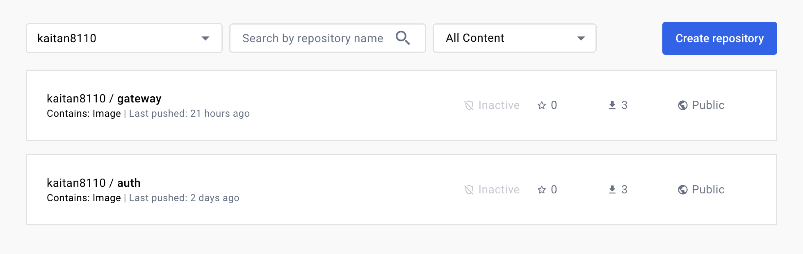
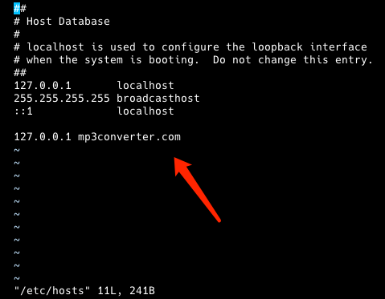

### Gateway Service

Cd into the root project directory. Then create a gateway directory. Next, initialise and activate a python environment. 
```
cd ../../
mkdir gateway
cd gateway
python -m venv venv
source ./venv/bin/activate
```

Create a `server.py` file, fill in below content and save. 
```
import os, gridfs, pika, json
from flask import Flask, request
from flask_pymongo import PyMongo
from auth import validate
from auth_svc import access
from storage import util

server = Flask(__name__)
server.config["MONGO_URI"] = "mongodb://host.minikube.internal:27017/videos"

mongo = PyMongo(server)
```

Next we will install all the dependencies. 
```
pip3 install pika flask pyMongo Flask-PyMongo
```

Continue writing code for `server.py`.  Save and exit. 
```
import os, gridfs, pika, json
from flask import Flask, request
from flask_pymongo import PyMongo
from auth import validate
from auth_svc import access
from storage import util

server = Flask(__name__)
server.config["MONGO_URI"] = "mongodb://host.minikube.internal:27017/videos"

mongo = PyMongo(server)

fs = gridfs.GridFS(mongo.db)

connection = pika.BlockingConnection(pika.ConnectionParameters("rabbitmq")) # Configure rabbitMQ connection, make communication with our rabbitMQ's queue synchronouns. 
channel = connection.channel()

@server.route("/login", methods=["POST"])
def login():
    token, err = access.login(request)
```

Create a directory named `auth_svc`. The `__init__.py` below essential marked the `auth_svc` directory as a package. 

```
mkdir auth_svc
cd auth_svc
touch __init__.py
```

Create an `access.py` file.  `access.py` is essentially a module that contains our login function. 
```
vim access.py 
```

Fill in the below content. Save and exit. 
```
import os, requests

def login(request):
    auth = request.authorization
    if not auth:
        return None, ("missing credentials", 401)
    
    basicAuth = (auth.username, auth.password)

    response = requests.post(
        f"http://{os.environ.get('AUTH_SVC_ADDRESS')}/login",
        auth=basicAuth
    )

    if response.status_code == 200:
        return response.text, None
    else:
        return None, (response.text, response.status_code)
```

Next, we will need to install `requests`. 
```
pip3 install requests
```

Continue filling code for `server.py`. 
```
import os, gridfs, pika, json
from flask import Flask, request
from flask_pymongo import PyMongo
from auth import validate
from auth_svc import access
from storage import util

server = Flask(__name__)
server.config["MONGO_URI"] = "mongodb://host.minikube.internal:27017/videos"

mongo = PyMongo(server)

fs = gridfs.GridFS(mongo.db)

connection = pika.BlockingConnection(pika.ConnectionParameters("rabbitmq")) # Configure rabbitMQ connection, make communication with our rabbitMQ's queue synchronouns. 
channel = connection.channel()

@server.route("/login", methods=["POST"])
def login():
    token, err = access.login(request)

    if not err:
        return token
    else:
        return err
    
@server.route("/upload", methods=["POST"])
def upload():
    access, err = validate.token(request)
```

Next, create a `validate` module. 
```
mkdir auth
cd auth
touch __init__.py
vim validate.py
```

Fill in below content for `validate.py`. Save and exit. 
```
import os, requests

def token(request):
    if not "Authorization" in request.headers:
        return None, ("missing credentials", 401)
    
    token = request.headers["Authorization"]

    if not token:
        return None, ("missing credentials", 401)
    
    response = request.post(
        f"http://{os.environ.get('AUTH_SVC_ADDRESS')}/validate",
        headers={"Authorization": token},
    )

    if response.status_code == 200:
        return response.text, None
    else:
        return None, (response.text, response.status_code)
```

Continue writing code for `server.py`. It should look like this now. 
```
import os, gridfs, pika, json
from flask import Flask, request
from flask_pymongo import PyMongo
from auth import validate
from auth_svc import access
from storage import util

server = Flask(__name__)
server.config["MONGO_URI"] = "mongodb://host.minikube.internal:27017/videos"

mongo = PyMongo(server)

fs = gridfs.GridFS(mongo.db)

connection = pika.BlockingConnection(pika.ConnectionParameters("rabbitmq")) # Configure rabbitMQ connection, make communication with our rabbitMQ's queue synchronouns. 
channel = connection.channel()

@server.route("/login", methods=["POST"])
def login():
    token, err = access.login(request)

    if not err:
        return token
    else:
        return err
    
@server.route("/upload", methods=["POST"])
def upload():
    access, err = validate.token(request)

    access = json.loads(access)

    if access["admin"]:
        if len(request.files) > 1 or len(request.files) < 1:
            return "exactly 1 file required", 400

        for _, f in request.files.items():
            err = util.upload(f, fs, channel, access)
        
            if err:
                return err
        
        return "success!", 200
    else: 
        return "not authorized", 401

@server.route("/download", methods=["GET"])
def download():
    pass
        
if __name__ == "__main__":
    server.run(host="0.0.0.0", port=8080)
```

Next, we need to create a `storage` package, and within that package, create a `util` module. 

Cd to the `gateway` directory and run the below commands. 
```
mkdir storage
cd storage
touch __init__.py
vim util.py
```

Fill in below code for `util.py`. Save and exit. 
```
import pika, json

def upload(f, fs, channel, access):
    try:
        fid = fs.put(f)
    except Exception as err:
        return "internal server error", 500
    
    message = {
        "video_fid": str(fid),
        "mp3_fid": None,
        "username": access["username"],        
    }

    try: 
        channel.basic_publish(
            exchange="",
            routing_key="video",
            body=json.dumps(message),
            properties=pika.BasicProperties(
                delivery_mode=pika.spec.PERSISTENT_DELIVERY_MODE
            ),
        )
    except:
        fs.delete(fid)
        return "internal server error", 500
```

Change to gateway root directory. Next, we can start creating the deployment for the gateway service. 
```
cd ..
```

We will freeze our dependencies into a `requirements.txt` file first.
```
pip3 freeze > requirements.txt
```

Create our Dockerfile. 
```
vim Dockerfile
```

Fill in below code. Save and exit. 
```
FROM python:3.10-slim-bullseye

RUN apt-get update \
    && apt-get install -y --no-install-recommends --no-install-suggests \
    build-essential \
    && pip install --no-cache-dir --upgrade pip

WORKDIR /app
COPY ./requirements.txt /app
RUN pip install --no-cache-dir --requirement /app/requirements.txt
COPY . /app

EXPOSE 8080

CMD ["python3", "server.py"]
```

Let's build our image. 
```
docker build .
```

Tag your image.
```
docker tag <fill-in-your-sha256> <your-docker-username>/gateway:latest
```

Push your image. 
```
docker push <your-docker-username>/gateway:latest
```

It automatically create a remote gateway repository for us. 


Next, we will create our kubernetes infrastructure deployment files. 

Create a `manifests` directory at the `gateway` directory level. And change directory to it. 
```
mkdir manifests
cd manifests
```

Create a `gateway-deploy.yaml`.
```
vim gateway-deploy.yaml
```

Fill in below code. Save and exit. 
```
apiVersion: apps/v1
kind: Deployment
metadata:
  name: gateway
  labels:
    app: gateway
spec:
  replicas: 2
  selector:
    matchLabels:
      app: gateway
  strategy:
    type: RollingUpdate
    rollingUpdate:
      maxSurge: 3
  template:
    metadata:
      labels:
        app: gateway
    spec:
      containers:
        - name: gateway
          image: kaitan8110/gateway
          envFrom:
            - configMapRef:
                name: gateway-configmap
            - secretRef:
                name: gateway-secret
```

Create a `configmap.yaml` file. 
```
vim configmap.yaml
```

Fill in below code. Save and exit. 
```
apiVersion: v1
kind: ConfigMap
metadata:
  name: gateway-configmap
data: 
  AUTH_SVC_ADDRESS: "auth:5000"
```

Create a `secret.yaml` file. 
```
vim secret.yaml
```

Fill in below code. Save and exit. 
```
apiVersion: v1
kind: Secret
metadata:
  name: gateway-secret
stringData:
  PLACEHOLDER: nothing
type: Opaque
```

Create a `service.yaml` file. 
```
vim service.yaml
```

Fill in below code. Save and exit. 
```
apiVersion: v1
kind: Service
metadata:
  name: gateway
spec:
  selector:
    app: gateway
  type: ClusterIP
  ports: 
    - port: 8080
      targetPort: 8080
      protocol: TCP
```

Create a `ingress.yaml` file. (To allow traffic to access our gateway endpoint)
```
vim ingress.yaml
```

Fill in below code. Save and exit. 
```
apiVersion: networking.k8s.io/v1
kind: Ingress
metadata:
  name: gateway-ingress
  annotations:
    nginx.ingress.kubernetes.io/proxy-body-size: "0"
    nginx.ingress.kubernetes.io/proxy-read-timeout: "600"
    nginx.ingress.kubernetes.io/proxy-sent-timeout: "600"
spec:
  rules:
    - host: mp3converter.com
      http:
        paths:
          - path: /
            pathType: Prefix
            backend:
              service:
                name: gateway
                port:
                  number: 8080
```

To make sure that `mp3converter.com` get routed to localhost, we need to edit a `hosts` file in your local setup. 
```
sudo vim /etc/hosts
```

Add a new line below to `hosts` file. 
```
127.0.0.1 mp3converter.com
```

Save and exit. 

We will now need to configure a minikube add-on to allow ingress. Run below command in your local environment to list the addons that minikube have. 
```
minikube addons list
```

Next, run below command to enable `ingress` addon. 
```
minikube addons enable ingress
```

Below shows `ingress` addon is enabled.


Basically, whenever we want to test this microservice architecture, we will need to run the `minikube tunnel` command. And when this is running, whenever we send request to our loopback address, it is going to go to our minikube cluster via the ingress. And since we map `mp3converter.com` to our loopback address, if we send request to `mp3converter.com`, they are going to go to this minikube tunnel. 
```
minikube tunnel
```

Next, we will try to create the gateway manifest files. Change directory to the gateway manifest directory.
```
kubectl apply -f ./
```

All the resources should be created now. 

But you should encounter an error in the gateway's pods as the `rabbitmq` service is still not deployed yet.


So let's just scale our deployment pods down now first, until `rabbitmq` is deployed.
```
kubectl scale deployment --replicas=0 gateway
```

From here we can start to get into the `rabbitmq` stuff. 