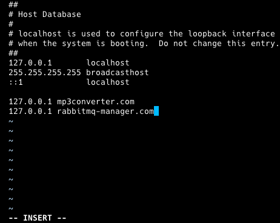
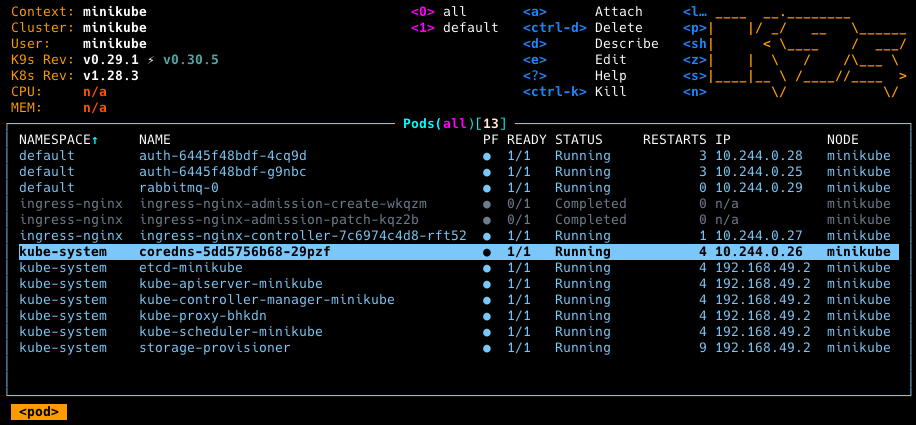
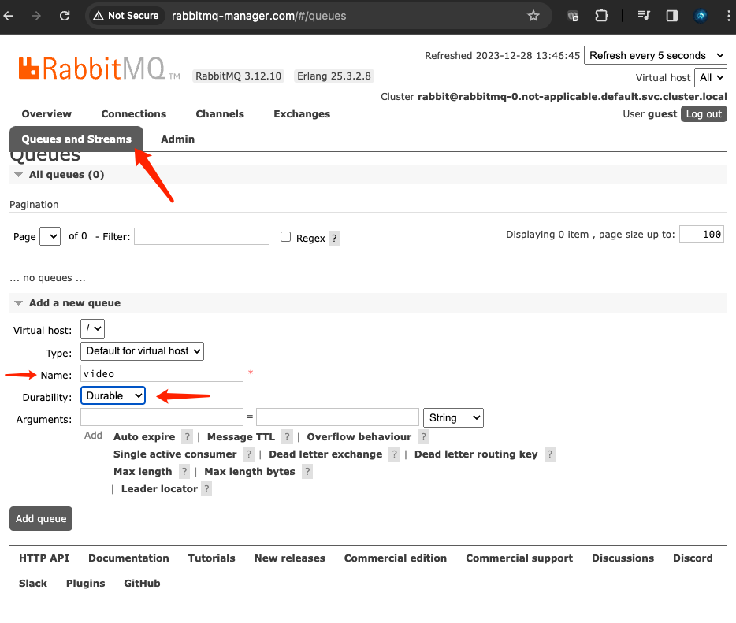
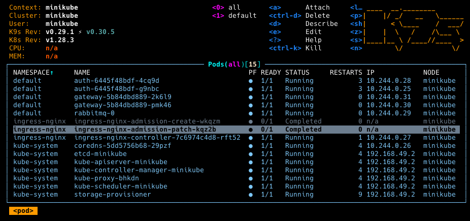

### Setup RabbitMQ Service

Change directory back to project root directory. 

Next, create a `rabbitMQ` directory. We shall named it `rabbit`. Then change directory into it.
```
mkdir rabbit
cd rabbit
```

For `rabbitMQ`, instead of making a deployment like the first two services, we are going to make a stateful set. As we need our queue to remain intact; even if the pods crashes. We want our queue and messages to stay persistent, until the messages are pull from the queue. 

Create a `manifests` directory, and change directory to it. 
```
mkdir manifests
cd manifests
```

Create a `statefulset.yaml` file. 
```
vim statefulset.yaml
```

Fill in below code. Save and exit. 
```
apiVersion: apps/v1
kind: StatefulSet
metadata:
  name: rabbitmq
spec:
  serviceName: "not-applicable"
  selector:
    matchLabels:
      app: rabbitmq
  template:
    metadata:
      labels:
        app: rabbitmq
    spec:
      containers:
        - name: rabbitmq
          image: rabbitmq:3-management
          ports:
            - name: http
              protocol: TCP
              containerPort: 15672
            - name: amqp
              protocol: TCP
              containerPort: 5672
          envFrom:
            - configMapRef:
                name: rabbitmq-configmap
            - secretRef:
                name: rabbitmq-secret
          volumeMounts:
            - mountPath: "/var/lib/rabbitmq"
              name: rabbitmq-volume
      volumes:
        - name: rabbitmq-volume
          persistentVolumeClaim:
            claimName: rabbitmq-pvc
```

Create a `pvc.yaml` file.
```
vim pvc.yaml
```

Fill in below code. Save and exit. 
```
apiVersion: v1
kind: PersistentVolumeClaim
metadata:
  name: rabbitmq-pvc
spec:
  accessModes:
    - ReadWriteOnce
  resources:
    requests:
      storage: 1Gi
  storageClassName: standard
```

Create a `service.yaml` file.
```
vim service.yaml
```

Fill in below code. Save and exit. 
```
apiVersion: v1
kind: Service
metadata:
  name: rabbitmq
spec:
  type: ClusterIP
  selector:
    app: rabbitmq
  ports:
    - name: http
      protocol: TCP
      port: 15672
      targetPort: 15672
    - name: amqp
      protocol: TCP
      port: 5672
      targetPort: 5672
```

As we are going to access the management interface of rabbitMQ from a web browser outside of the cluster at port 15672, we will need to create an ingress to allow access to it.

Create a `ingress.yaml` file.
```
vim ingress.yaml
```

Fill in below code. Save and exit. 
```
apiVersion: networking.k8s.io/v1
kind: Ingress
metadata:
  name: rabbitmq-ingress
spec:
  rules:
    - host: rabbitmq-manager.com
      http:
        paths:
          - path: /
            pathType: Prefix
            backend:
              service:
                name: rabbitmq
                port:
                  number: 15672
```

Edit hosts file.
```
sudo vim /etc/hosts
```

Add a new line as below. Save and exit. 
```
127.0.0.1 rabbitmq-manager.com
```


Next, create a `configmap.yaml`. We currently do not need a `configmap` but just in case we need it in future, we will create a template placeholder first. 
```
vim configmap.yaml
```

Fill in below code. Save and exit. 
```
apiVersion: v1
kind: ConfigMap
metadata:
  name: rabbitmq-configmap
data:
  PLACEHOLDER: "NONE"
```

We will do the same thing for `secret.yaml`. Create it with:
```
vim secret.yaml
```

Fill in below code. Save and exit. 
```
apiVersion: v1
kind: Secret
metadata:
  name: rabbitmq-secret
stringData:
  PLACEHOLDER: "NONE"
type: Opaque
```

Lets try to apply our manifest files with: 
```
kubectl apply -f ./ 
```

The resources should be created now. Run the below command to check if `rabbitMQ` pod is up.
```
K9s
```

RabbitMQ pod is running as shown below. 


Let's try to access `rabbitmq-manager.com` in our browser. (Remember to run the `minikube tunnel` command in a separate terminal, and keep it running)


For first-time login, both username and password are `guest`.

It should look something like that after login.


Let's add a `video` queue by going through the below steps. Then click on `Add queue`.


Now we have our video queue here.


Now, let's see whether we can start up our gateway server.

Change directory to gateway manifests directory first.

Then run:
```
kubectl apply -f ./
```

We can see our gateway pods are up now.


Change directory to project root directory. We will then need to create a `converter` service.