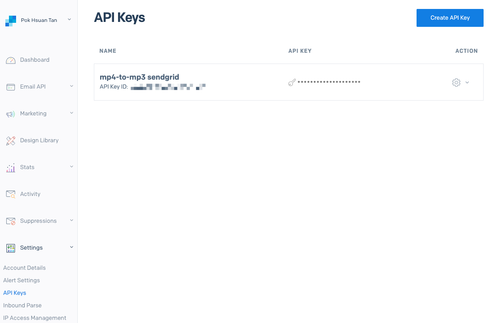

### Notification Service

Change to the root project directory, and create a new `notification` directory. Then change directory to it. 
```
mkdir notification
cd notification
```

Create a `consumer.py` file. 
```
vim consumer.py
```

Edit as follows. Save and exit. 
```
import pika, sys, os, time
from send import email

def main():
    # rabbitmq connection
    connection = pika.BlockingConnection(
        pika.ConnectionParameters(host="rabbitmq")
    )
    channel = connection.channel()

    def callback(ch, method, properties, body):
        err = email.notification(body)
        print("callback err: ", err)
        if err:
            ch.basic_nack(delivery_tag=method.delivery_tag)
        else:
            ch.basic_ack(delivery_tag=method.delivery_tag)

    channel.basic_consume(
        queue=os.environ.get("MP3_QUEUE"), on_message_callback=callback
    )
    
    print("Waiting for messages. To exit press CTRL+C")

    channel.start_consuming()

if __name__ == "__main__":
    try:
        main()
    except KeyboardInterrupt:
        print("Interrupted")
        try:
            sys.exit(0)
        except SystemExit:
            os._exit(0)```
```

Make a `send`directory within notification directory. 
```
mkdir send
cd send
```

Create a `__init__.py` file in it. 
```
touch __init__.py
```

Create an `email.py` file. Save and exit. 
```
vim email.py
```

```
import smtplib, os, json
from email.message import EmailMessage

def notification(message):
    try:
        message = json.loads(message)
        mp3_fid = message["mp3_fid"]
        sender_address = os.environ.get("GMAIL_ADDRESS")
        sender_password = os.environ.get("GMAIL_PASSWORD")
        receiver_address = message["username"]

        msg = EmailMessage()
        msg.set_content(f"mp3 file_id: {mp3_fid} is now ready!")
        msg["Subject"] = "MP3 Download"
        msg["From"] = sender_address
        msg["To"] = receiver_address

        session = smtplib.SMTP("smtp.gmail.com")
        session.starttls()
        session.login(sender_address, sender_password)
        session.send_message(msg, sender_address, receiver_address)
        session.quit()
        print("Mail Sent")

    except Exception as err:
        print(err)
        return err
```

Next we need to install pika in the `notification service` python virtual environment. 
Create and activate the virtual env. 
```
python3 -m venv venv
source ./venv/bin/activate
```

Install `pika`. 
```
pip3 install pika
```

Copy the dockerfile from gateway service to current directory. 
```
cp ../gateway/Dockerfile ./
```

Edit the Dockerfile as below. Save and exit. 
```
FROM python:3.10-slim-bullseye

RUN apt-get update \
    && apt-get install -y --no-install-recommends --no-install-suggests \
    build-essential \
    && pip install --no-cache-dir --upgrade pip

WORKDIR /app
COPY ./requirements.txt /app
RUN pip install --no-cache-dir --requirement /app/requirements.txt
COPY . /app

# Set the environment variable
ENV PYTHONUNBUFFERED=1

CMD ["python3", "consumer.py"]
```

Copy the manifests directory from converter service. 
```
cp -r ../converter/manifests ./
```

Change to manifests directory. 
```
cd manifests
```

Change file name of `converter-deploy.yaml` to `notification-deploy.yaml`. 
```
mv convert-deploy.yaml notification-deploy.yaml
```

Change all occurrence of `converter` to `notification.` 
```
apiVersion: apps/v1
kind: Deployment
metadata:
  name: notification
  labels:
    app: notification
spec:
  replicas: 1
  selector:
    matchLabels:
      app: notification
  strategy:
    type: RollingUpdate
    rollingUpdate:
      maxSurge: 8
  template:
    metadata:
      labels:
        app: notification
    spec:
      containers:
        - name: notification
          image: kaitan8110/notification
          envFrom:
            - configMapRef:
                name: notification-configmap
            - secretRef:
                name: notification-secret
```

Edit the `configmap.yaml` and `secret.yaml` as follows as well. Save and exit. 
```
apiVersion: v1
kind: ConfigMap
metadata:
  name: notification-configmap
data:
  MP3_QUEUE: "mp3"
  VIDEO_QUEUE: "video"
```

```
apiVersion: v1
kind: Secret
metadata:
  name: notification-secret
stringData:
  PLACEHOLDER: "NONE"
type: Opaque
```

Let's create a requirements.txt file. Change directory to the root notification directory. 
```
pip3 freeze > requirements.txt
```

Next build, tag and push docker image.
```
docker build .
docker tag <copy-and-paste-the-sha256-here-after-you-built-the-image> <your-docker-username>/notification:latest
docker push <your-docker-username>/notification:latest
```

You should see a newly created image in your docker hub account. 


The next thing we need to do, is to configure our gmail account, to allow non-google account to log in. However, recently I have just realised that google no longer support "less secure apps" access. 

To adapt our code to work with Gmail, we'll need to implement OAuth 2.0 for authentication. This process is a bit more complex than the basic username and password authentication but it's more secure and recommended by Google.

Here are the general steps we need to follow:

1. **Create a Project in Google Cloud Console**: If you haven't already, you'll need to create a project in the Google Cloud Console.
    
2. **Enable Gmail API**: In your Google Cloud project, enable the Gmail API.
    
3. **Create Credentials**: In the API & Services -> Credentials section, create OAuth client ID credentials. You'll need to configure the consent screen and set up the application type as a desktop app.
    
4. **Download the Credentials**: Download the JSON file containing the credentials and save it in your project directory.
    
5. **Install Google Client Library**: You'll need the Google Client Library in your Python environment. Install it using pip:

```
pip install --upgrade google-api-python-client google-auth-httplib2 google-auth-oauthlib
```

**Modify Your Code**: You'll need to modify your code to use the OAuth 2.0 credentials for authentication. Here's an example of how you could adapt your `notification` function:

```python
import os
import json
from email.message import EmailMessage
from google_auth_oauthlib.flow import InstalledAppFlow
from googleapiclient.discovery import build
from googleapiclient.errors import HttpError
from google.auth.transport.requests import Request
from google.oauth2.credentials import Credentials

# If modifying these SCOPES, delete the file token.json.
SCOPES = ['https://www.googleapis.com/auth/gmail.send']

def service_gmail():
    creds = None
    # The file token.json stores the user's access and refresh tokens, and is
    # created automatically when the authorization flow completes for the first
    # time.
    if os.path.exists('token.json'):
        creds = Credentials.from_authorized_user_file('token.json', SCOPES)
    # If there are no (valid) credentials available, let the user log in.
    if not creds or not creds.valid:
        if creds and creds.expired and creds.refresh_token:
            creds.refresh(Request())
        else:
            flow = InstalledAppFlow.from_client_secrets_file(
                'credentials.json', SCOPES)
            creds = flow.run_local_server(port=0)
        # Save the credentials for the next run
        with open('token.json', 'w') as token:
            token.write(creds.to_json())

    try:
        service = build('gmail', 'v1', credentials=creds)
        return service
    except HttpError as error:
        print(f'An error occurred: {error}')
        return None

def create_message(sender, to, subject, message_text):
    message = EmailMessage()
    message.set_content(message_text)
    message['to'] = to
    message['from'] = sender
    message['subject'] = subject

    raw = base64.urlsafe_b64encode(message.as_bytes())
    raw = raw.decode()
    body = {'raw': raw}
    return body

def send_message(service, user_id, message):
    try:
        message = (service.users().messages().send(userId=user_id, body=message)
                   .execute())
        print('Message Id: %s' % message['id'])
        return message
    except HttpError as error:
        print(f'An error occurred: {error}')

def notification(message):
    try:
        message = json.loads(message)
        mp3_fid = message["mp3_fid"]
        sender_address = os.environ.get("GMAIL_ADDRESS")
        receiver_address = message["username"]
        subject = "MP3 Download"
        message_text = f"mp3 file_id: {mp3_fid} is now ready!"

        service = service_gmail()
        if service:
            msg = create_message(sender_address, receiver_address, subject, message_text)
            send_message(service, "me", msg)

    except Exception as err:
        print(err)
```

This is a simplified example. In a production environment, we would also want to handle token expiration and refreshing more robustly.

Remember, you'll need to follow the prompts to authenticate the first time you run this script, and it will save a token for subsequent uses.

However, after trying many ways, I still couldn't make it work with Gmail's SMTP server. I have tried to use the username and password method, but currently Gmail does not support "less secure app" access. So this option is out. Thereafter, I tried to use OAuth 2.0. But it requires user to manually click the "Allow access", when the browser pops out. However, since we are running with docker, we are not able to manually click the "allowed access". So this option is out as well. Finally, I tried to integrate using service account. To make this option works, service account will need to have domain-wide delegation setup, and in-turn it would requires access to a Google Workspace administrator account. Since this is a personal hobby project and i don't have access to that, this option is unworkable yet again.

Thus I have decided to not use Gmail's SMTP server altogether, and seek to use other third-party email sending service like SendGrid, Mailgun, or Amazon SES. These services provide APIs to send emails and are generally easy to integrate into our Python projects. 

In our case, we will use SendGrid, which is popular for its ease of use and generous free tier. 

### Step 1: Sign Up for SendGrid and Get an API Key

- Sign up for a SendGrid account at [SendGrid.com](https://sendgrid.com/).
- Once signed in, create an API Key with email sending permissions.

### Step 2: Install the SendGrid Python Client

Install the SendGrid Python client library via pip:
```
pip install sendgrid
```

Remember update the requirements.txt
```
pip3 freeze > requirements.txt
```
### Step 3: Modify Our Code to Use SendGrid

Here's how you can modify our existing Python script to use SendGrid:

```
import os
import json
from sendgrid import SendGridAPIClient
from sendgrid.helpers.mail import Mail

def send_email(sender, recipient, subject, content):
    message = Mail(
        from_email=sender,
        to_emails=recipient,
        subject=subject,
        plain_text_content=content
    )
    try:
        sg = SendGridAPIClient(os.environ.get('SENDGRID_API_KEY'))
        response = sg.send(message)
        print('Email sent! Status code:', response.status_code)
    except Exception as e:
        print("Error within send_email func: ", e)

def notification(payload):
    try:
        message = json.loads(payload)
        mp3_fid = message["mp3_fid"]
        sender_address = os.environ.get('SENDGRID_SENDER_EMAIL')  # Replace with your SendGrid sender email
        receiver_address = message["username"]
        subject = "MP3 Download"
        message_text = f"mp3 file_id: {mp3_fid} is now ready!"

        send_email(sender_address, receiver_address, subject, message_text)

    except Exception as e:
        print("Error within notification func: ", e)
        return e 

# Example usage
# notification(json.dumps({"mp3_fid": "12345", "username": "example@email.com"}))
```

As we have changed our python script, we will need to rebuild our docker image, and push to docker hub remote image repository. 

You will need to recreate the notification's kubernetes resources if you have changed any of the manifests' files.  Navigate to the notification's manifest directory. 
```
kubectl delete -f ./
kubectl apply -f ./
```

### Important Notes:

1. **Environment Variable**: Store your SendGrid API key in an environment variable (`SENDGRID_API_KEY`). Never hardcode your API keys in your source code.
2. **Sender Email**: Ensure that the sender email (`your-email@example.com`) is verified with SendGrid. You can do this in your SendGrid dashboard.
3. **Error Handling**: The script includes basic error handling, which you can expand based on your requirements.

This approach using SendGrid is straightforward and doesn't rely on Google's infrastructure. You can easily adapt this example to use other email services like Mailgun or Amazon SES by using their respective libraries and APIs.


<u>Additional screenshots for reference</u>


(Sendgrid API Keys)


(You can monitor whether the gateway, converter or notification services are connected to rabbitmq server by looking at the channels here)


(I have tested two times, and thus have received two emails)

Now let's try to download the mp3 file using the mp3 file_id that was sent to our email. 

Run below command in terminal. 
```
curl --output mp3_download.mp3 -X GET -H 'Authorization: Bearer <replace-with-your-token>' 'http://mp3converter.com/download?fid=65a3510d1832669a3613fa81'
```

The `mp3_download.mp3` is downloaded in current directory. 


That means our end-to-end application is fully working now. 